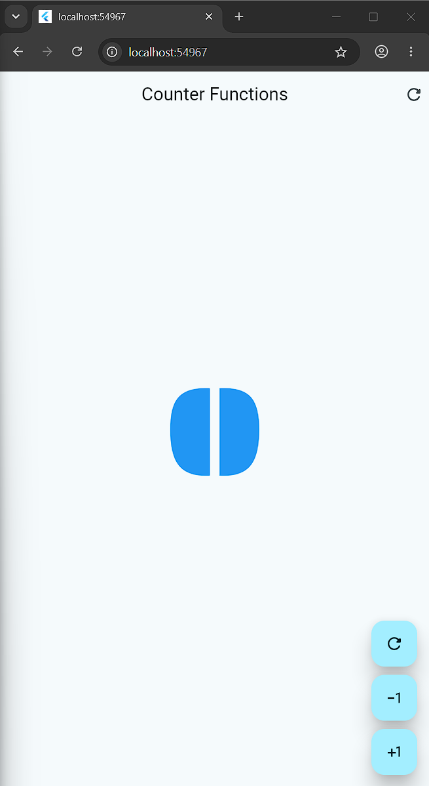
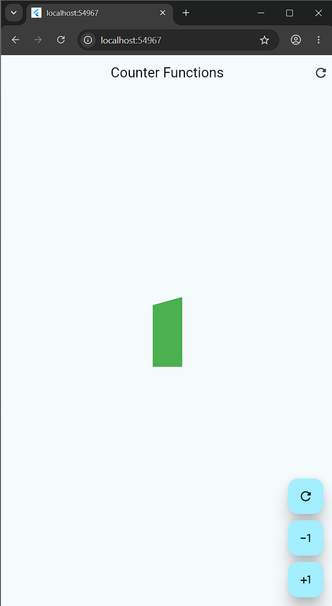
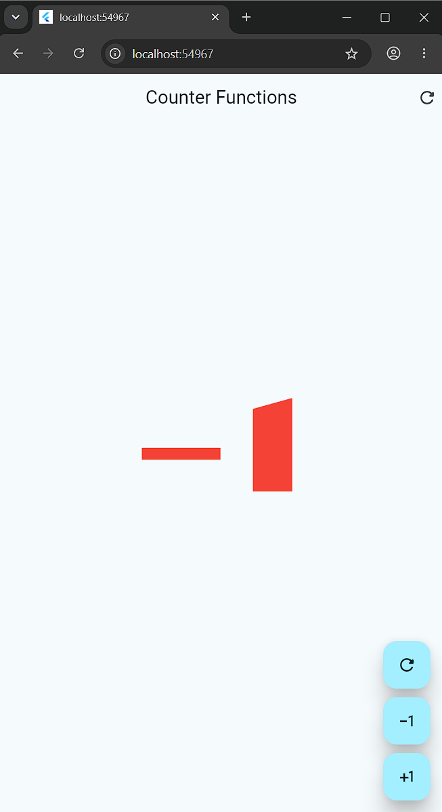
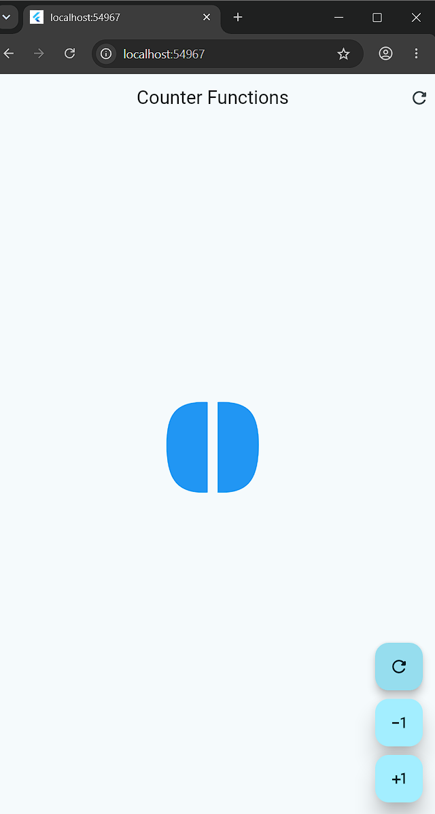

# Practica 02: Mi primera aplicacion movil con Flutter

Aplicacion desarrollada para la materia **Desarrollo Movil Integral**. El objetivo es practicar la creacion de interfaces en Flutter y el manejo del estado con `StatefulWidget`.

## Objetivos

- Crear una aplicacion multiplataforma con Flutter y Dart.
- Implementar un contador con estado mutable.
- Actualizar la interfaz con `setState`.
- Organizar la aplicacion mediante widgets reutilizables.
- Aplicar estilos y tipografia personalizada con `google_fonts`.

## Descripcion de la aplicacion

`hello_world_app` muestra la pantalla **Counter Functions**, que permite:

- Incrementar el contador con el boton `+1`.
- Disminuir el contador con el boton `-1`.
- Reiniciar el contador desde cero.
- Cambiar el color del numero segun su valor: azul cuando es cero, verde cuando es positivo y rojo cuando es negativo.

La pantalla principal se implementa como un `StatefulWidget` en [`counter_functions_screen.dart`](hello_world_app/lib/presentation/Screens/counters/counter_functions_screen.dart). La entrada de la aplicacion se encuentra en [`main.dart`](hello_world_app/lib/main.dart).

## Tecnologias

| Tecnologia | Uso |
|---|---|
| Flutter | Framework para la interfaz multiplataforma |
| Dart | Lenguaje de programacion |
| Material 3 | Componentes y tema visual |
| Google Fonts | Tipografia personalizada |

## Ejecucion del proyecto

Requisitos: Flutter instalado y un dispositivo o emulador configurado.

```bash
cd hello_world_app
flutter pub get
flutter run
```

Para ejecutar las pruebas:

```bash
flutter test
```

## Arquitectura

- [Diagrama de arquitectura de la aplicacion](diagrama_arquitectura/arquitectura_aplicacion_movil.visual-check.html)
- [Version publicada del diagrama](https://artvrolouv.github.io/Practicas_DMI_230629/)

## Evidencias

Las siguientes capturas muestran distintos estados de ejecucion de la aplicacion:

### Estado inicial



### Contador positivo



### Contador negativo



### Reinicio del contador



## Estructura principal

```text
Practica 02/
├── hello_world_app/
│   ├── lib/
│   │   ├── main.dart
│   │   └── presentation/Screens/counters/
│   │       ├── counter_functions_screen.dart
│   │       └── counter_screen.dart
│   ├── pubspec.yaml
│   └── test/
├── images/
└── diagrama_arquitectura/
```