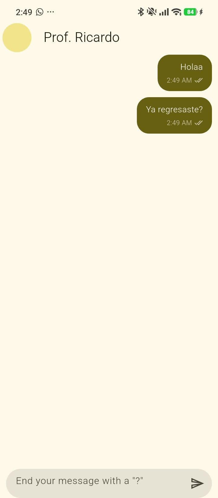
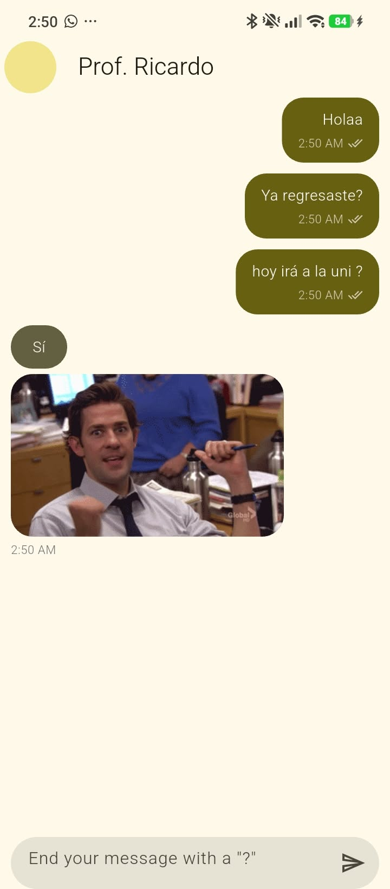
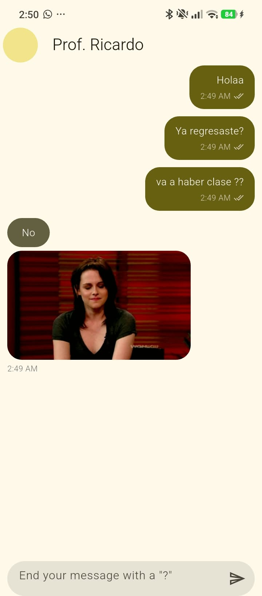
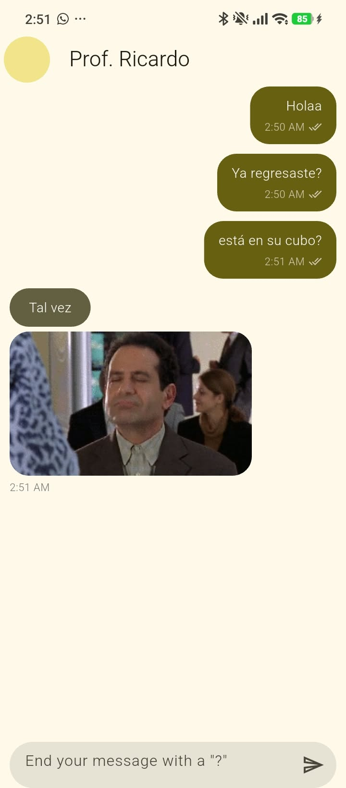

# yes_no_app
Aplicación de chat desarrollada con Flutter. Permite enviar mensajes y recibir una respuesta de tipo **Sí**, **No** o **Tal vez**, acompañada de un GIF.

## Link Page

[Diagrama de Arquitectura](https://artvrolouv.github.io/Practicas_DMI_230629/Practica03/yes_no_app/arquitectura/arquitectura_proyecto.html)

## Funcionalidades

- Interfaz de conversación con mensajes diferenciados para el usuario y el asistente.
- Respuestas obtenidas desde la API pública [YesNo.wtf](https://yesno.wtf/).
- Desplazamiento automático al mensaje más reciente.
- Mensaje de error cuando no se puede consultar la API.
- Estado del chat gestionado con `provider`.

## Capturas de pantalla / Evidencias

| Estado Inicial | Respuesta: Sí |
| :---: | :---: |
|  |  |

| Respuesta: No | Respuesta: Tal vez |
| :---: | :---: |
|  |  |


## Requisitos

- Flutter instalado y configurado.
- Una conexión a Internet para consultar la API.

## Ejecutar el proyecto

Desde esta carpeta (`Practica03/yes_no_app`), instala las dependencias y ejecuta la aplicación:

```bash
flutter pub get
flutter run
## Estructura

```text
lib/
├── config/theme/          # Tema de la aplicación
├── domain/entities/       # Modelo de mensaje
└── presentation/
	├── providers/         # Estado y lógica del chat
	├── screens/chat/      # Pantalla principal
	└── widgets/           # Campo de entrada y burbujas de mensajes
```

## API

Al enviar un mensaje, la aplicación consulta `https://yesno.wtf/api`. La respuesta incluye el resultado y la URL de un GIF. El resultado puede variar entre **Sí**, **No** y **Tal vez**.
